# Coastal Monitoring Using Satellite Altimetry  

This repository contains my workflow for analysing coastal sea level variability along Bangladesh using multi-mission satellite altimetry Jason-3 & Sentinel-3. Please excuse me for not inlcuding the references in this version, my intentions were to just get any results over to you. I apologise for the lack of communication over these last few months.

 My main goals were to:  
- Subset and preprocess global SLA data for the Bangladesh coast.  
- Collocate Jason-3 and Sentinel-3 observations.  
- Interpolate SLA fields and validate cross-mission consistency.  
- Experiment with simple ML models and Gaussian Processes to map biases and coastal SLA structure.  

---

## 1. Preprocessing  

The starting point was the global CMEMS DUACS SLA dataset.  

- I intially Subset to a bounding box of coordinates **88–93°E, 20–26°N** which was my chosen area of the coast to study. This was in the hopes that I could keep the workflow light and focused on the coast instead of the full global grid.  

**Output:**  
- `processed_sla_2024_bangladesh.nc`  

---

## 2. Sentinel-3 SRAL (20 Hz) Track Extraction  

Steps:  
- I Subset raw SRAL data to the same region/time window.  
- Flattened into a table (`lon, lat, time, SLA`).  
- Saved per-track files for later use.  

when looking at the data I had to process it this way as the Jason-3 follows fixed ground tracks, so SRAL data needed to be reshaped to align for collocation.  

**Output:**  
- Flattened track files in `/Preprocessing`  

---

## 3. Collocation

In this collab both J3 and Sentinel 3 files were collocated. This is where I was trying hard to code everything but had to utilise Ai to develop the code. Had lots of helpful input from your jupyter notebooks and githubs describing these problems

- **Windows:** Primary run used 10 km / 24 h, following typical altimetry matchup studies.
A secondary “relaxed” run (20 km / 36 h) was tested to check sensitivity to looser thresholds.

- **QC filters:** SLA values outside ±3 m were removed, consistent with CMEMS/AVISO DUACS guidance.
Applied a robust ΔSLA filter based on the Median Absolute Deviation (MAD) and it was capped at ±1.5 m, to reject false pairings

- **Bias correction:** A daily-median bias correction was applied, as recommended in cross-calibration studies to remove short-term orbit/instrument drifts).  

**Outputs:**  
- `s3_j3_pairs_baseline_qc.parquet`  
- Daily/monthly bias CSVs  

---

## 4. Interpolation & Analysis (InterpolationV2)  

After collocation and QC, the next step was to generate continuous SLA fields along the Bangladesh coast from the irregularly spaced Sentinel-3 ground tracks. Interpolation was required because altimetry provides point measurements along orbital tracks, while the gridded fields (like DUACS) are needed for regional analysis. I attempted to produce lots of figures still trying to unpack each one but you can have look in more detail at the bottom of this repository.  

- **Interpolation:** A Radial Basis Function (RBF) with a thin-plate spline kernel was used to interpolate SLA from track points onto a regular grid. There are quite a few ways I could have done the interpolation. Including simple methods like inverse distance weighting (IDW), which was quick but smoothed everything too much so my plots looked weak. A more advanced option would be kriging or Gaussian Processes, which are nice because they give uncertainty estimates, but they’re slower and need a lot of tuning. There’s also optimal interpolation (OI), which is what the CMEMS/DUACS products use, but that relies on having a background covariance model, which I didn’t set up here. For this project I stuck with radial basis functions (thin-plate spline). It was smoother than IDW with less parameters than kriging, and it works well for scattered altimetry tracks. The idea was to keep it simple but still realistic, so I can compare my outputs with the DUACS fields without the extra overhead of building a full geostatistical model.

- The Interpolation was performed onto a 0.125° × 0.125° grid, chosen to match the CMEMS DUACS Level-4 product resolution hoping to ensure direct comparability between the custom-interpolated Sentinel-3 maps and Jason-3’s global gridded reference fields

- **Validation:** 
To check whether the interpolation and bias correction was actually working lots of figures and tests were developed. The figures have not been fully interpreted yet 

Scatter plots (Fig. 2):
Jason-3 DUACS values were plotted against my bias-corrected Sentinel-3 interpolated values. If the two missions agree, the points should fall along a 1:1 line. 

RMSE vs distance/time (Fig. 3):
This gives a sense for setting collocation thresholds.

Residual maps (Fig. 4):
Even after corrections of the data there could be areas where Jason-3 consistently reads a little higher or lower than S3. By gridding the differences on a 0.25° grid, I was hoping to see those biases cluster in space.

Seasonal cycles (Fig. 6):
Finally, I checked whether both missions capture the same broad seasonal trends (monsoon vs post-monsoon). I plotted monthly means with 95% confidence intervals. The goal was to see if the interpolated Sentinel-3 follows the Jason-3 seasonal cycle within uncertainties.

**Figures produced:**  
1. Daily bias method comparison  
2. Scatter (S3bc vs J3)  
3. RMSE vs collocation gap  
4. Spatial residual map  
5. Daily interpolated maps  
6. Seasonal SLA cycle (monsoon vs rest)  
+ stricter QC scatter  

**Outputs:**  
- `s3bc_interpolated_daily_rbf_baseline_qc.nc`  
- `daily_pair_stats_baseline_qc.csv`  
- `monthly_interp_pair_stats_baseline_qc.csv`  
- Figures under `/InterpolationV2/Figures`  

---

## 5. Machine Learning Experiments (ML)  

In this collab I was attempting to do two experimental approaches to model SLA biases and coastal fields, heavily taking inspiration from your notebooks

5.1 Ridge Regression Bias Maps

For the first experiment I wanted to see if the bias between Sentinel-3 (bias-corrected) and Jason-3 could be predicted in a structured way, rather than just treated as random noise. At first I was thinking to  train on one month and then predict another future month. However, I adapted the model because SLA bias patterns aren’t guaranteed to stay the same month-to-month. For example, the monsoon season brings in big changes in water mass and dynamics along the coast, while the post-monsoon period is calmer. Training on September and then trying to predict October the model dynamics shifted The relationship between Sentinel-3 and Jason-3 because the bias for these months can't be fixed.

During the monsoon months, sea level is strongly influenced by river discharge, rainfall, and winds so the biases looked larger or structured in one way.

In the post-monsoon months, the ocean calms down and the bias pattern looked completely different.

The spatial terms it learned in September may no longer apply and it gave poor predictions.

The ridge regression was very simple. first the target variable was defined Δ = (S3bc − J3). To predict it, I used a really simple model with just a few features: polynomial terms of latitude/longitude and a seasonal cycle term which accounts for monsoon vs post-monsoon shifts. For validation, I used GroupKFold by month, so the model never got to train and test on the same month. That way it’s a fairer check of whether the seasonal signal actually carries across.

The model then produced a bias map for a target month on a 0.25° grid, showing where S3bc tends to sit higher or lower than J3. I compared this against a really simple baseline (just using the monthly mean bias) to check whether the regression was actually adding value.

Outputs included:

Bias maps (PNG + parquet).

Scatter plots of predicted vs observed Δ.

A JSON file with the model coefficients/settings.

A metrics CSV so I could compare against the baseline.

Why ridge regression?
I picked ridge because it’s simple and interpretable especially for my own level of understanding — I was actually able to see coefficients for lat, lon, and seasonal terms, so it was clear to interpret if the bias grows toward the coast or changes with the monsoon. It was developed to be robust to noise thanks to the L2 penalty and it runs super fast even on small datasets. 

Other options were on the table — e.g. Random Forests or boosted trees for nonlinearity, or Gaussian Processes for spatial smoothness — but my dataset was much smaller than anything I worked on in class so just chose a simpler model.

### 5.2 Gaussian Process “GPSat-style” Maps  

I used Gaussian Process Regression (GPR) to build  GPSat-style maps which were the high-resolution interpolations of SLA that try to respect both spatial and temporal structure in the data. this was added after I saw your notebook from week 8 and I really wanted to try and develop figures that looked aesthetic. Ai helped me developing your code to fit my parameters

Why tiling?
Full GP across the whole domain would be way too heavy computationally. So  it tiled the region into 1° boxes with 0.5° overlap. This way each GP stays manageable, but the overlap avoids sharp edges when stitching back together.

Why this kernel?
A kernel of Const × RBF([60 km, 60 km, 1.5 d]) + White noise was developed

The RBF (radial basis) captures smooth spatial/temporal correlations this meant that the sea level doesn’t jump around randomly, it tends to vary smoothly across tens of km and a few days.

Length-scales: 60 km in space and ~1.5 days in time seemed like a good compromise between smoothing and keeping local features.

The white noise term acknowledges measurement noise in altimetry.

Stitching with uncertainty:
Once each tile is fitted, It was blended using inverse-variance weighting. Tiles with lower uncertainty (better constrained by data) dominate more, while tiles with high uncertainty (data-sparse) contribute less.

Outputs:
This gives daily 0.05° SLA maps with both mean and uncertainty. The uncertainty maps are especially useful — they highlight regions where we should trust the interpolated field less, usually further offshore or in areas with sparse track coverage.

## Figures

The figures included here are preliminary outputs from my workflow. At this stage, I just wanted to get something to you they are mainly meant to demonstrate the processing pipeline (collocation, interpolation, and bias correction) and the types of analyses I can generate from Jason-3 and Sentinel-3 altimetry data.

I have not yet fully validated or interpreted each figure in detail. Some maps and diagnostics may contain noise or patterns that still need to be checked. I was just hopig to show some capability

The proper evaluation and interpretation of these results will follow in the written report.

### 1. Daily Bias Stability  
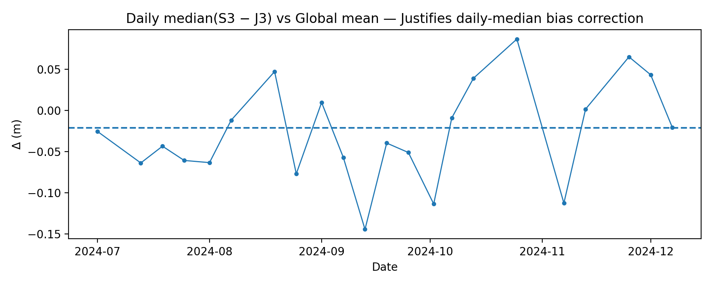  
Daily median bias (Sentinel-3 minus Jason-3) compared with the global mean.  

---

### 2. Cross-Mission SLA Comparison  
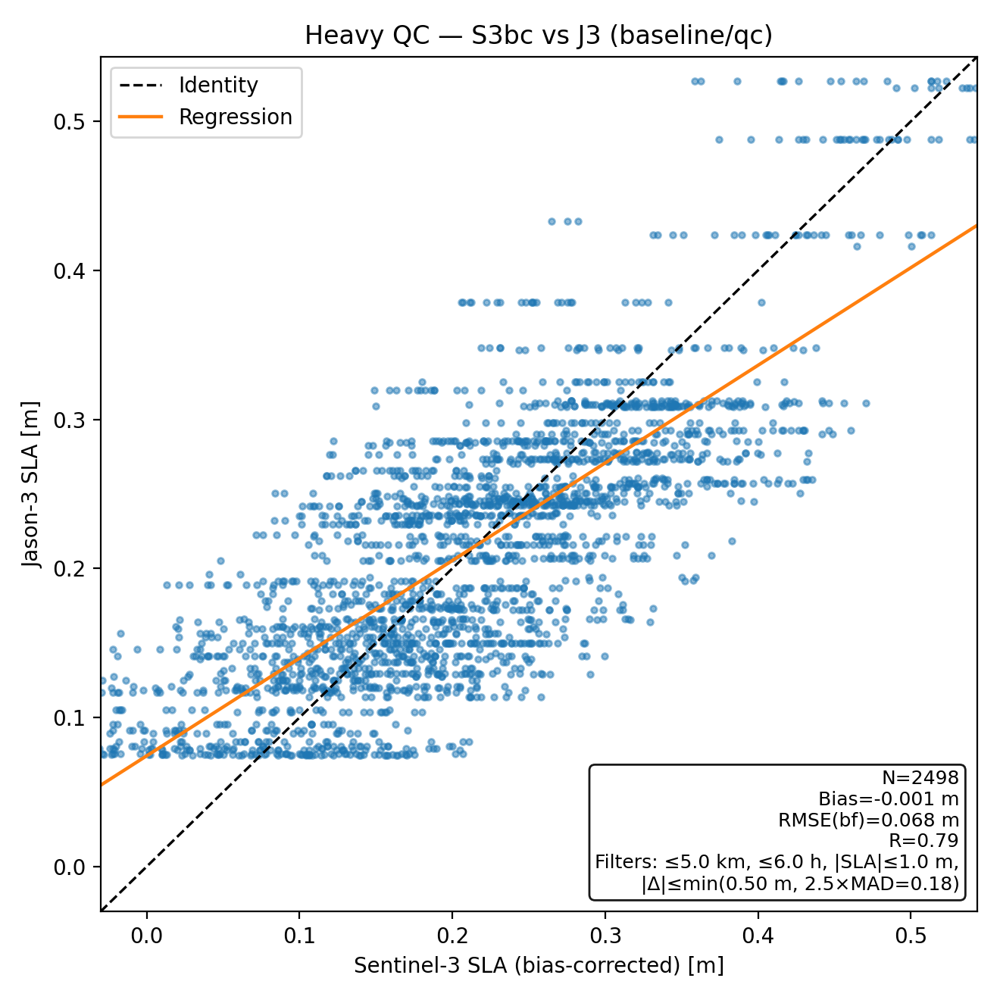  
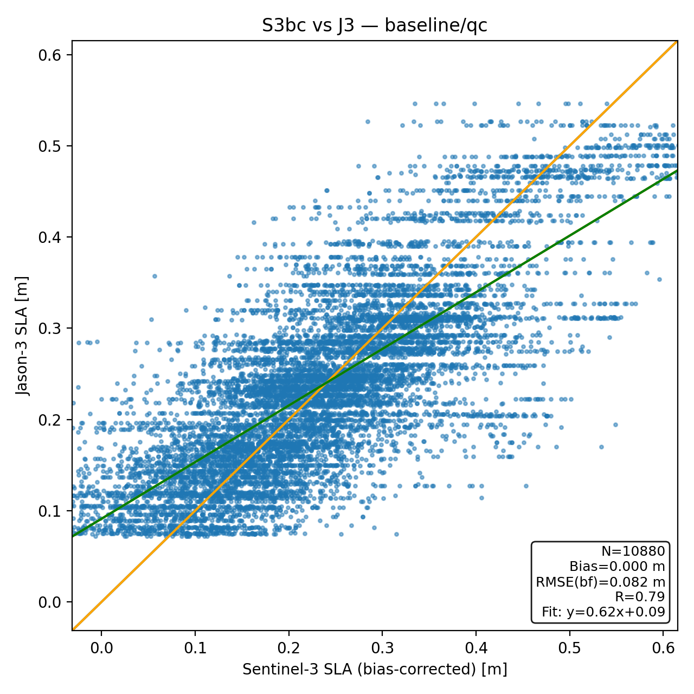  
Scatter plots comparing Sentinel-3 and Jason-3 SLA under strict QC.  

- **top:** A heavy scatter including all pairs.  
- **bottom:** A corrected view (S3 bias-corrected vs Jason-3).  

---

### 3. Validation Trade-offs  
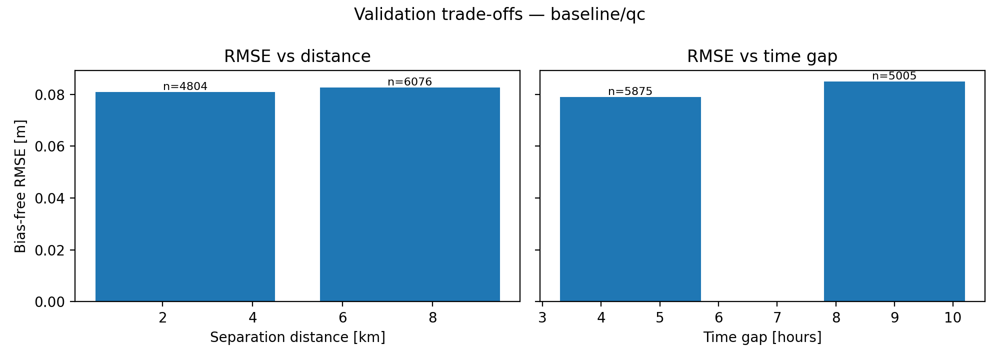  
RMSE plotted as a function of spatial separation and temporal difference between collocated points.  

---

### 4. Residual Bias Map (0.25° grid)  
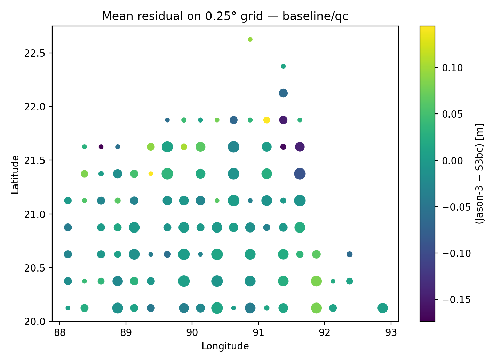  
Spatial distribution of mean residuals (Jason-3 minus S3bc) averaged onto a 0.25° grid.  

- **Green areas:** close agreement (near zero).  
- **Blue patches:** Jason-3 lower than S3bc.  
- **Red patches:** Jason-3 higher than S3bc.  

---

### 5. Example Day (2024-10-25)  
  
Three-panel view of a single day:  

- **Left:** Interpolated S3bc SLA (RBF method).  
- **Middle:** Jason-3 DUACS SLA (daily gridded).  
- **Right:** Difference (Jason-3 − S3bc).  

---

### 6. Seasonal Cycle (Jul–Dec 2024)  
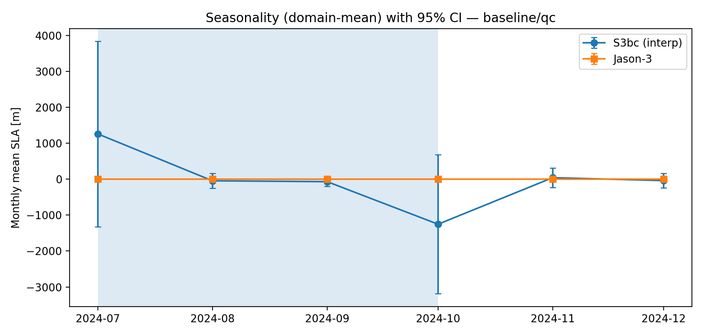  
Monthly SLA means for Jason-3 and interpolated S3bc, with 95% confidence intervals.  

- Jason-3: stable monthly means with low uncertainty.  
- S3bc: noisier, particularly during monsoon months (July, October) when track coverage is sparse.  

---

### 7. Gaussian Process Interpolation  
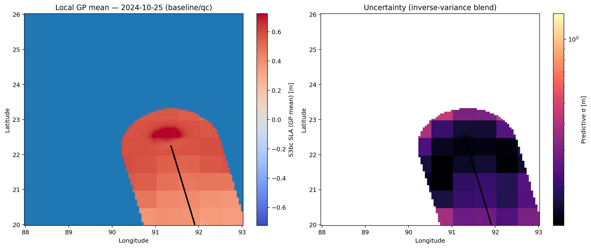  
Interpolated SLA fields from Sentinel-3, showing both mean SLA and uncertainty.  

---

### 8. SLA Fields Over Bangladesh  
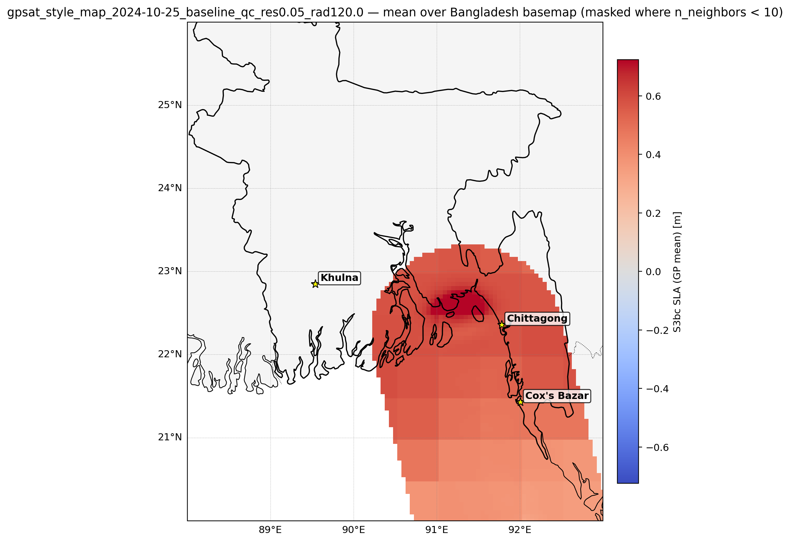  
Interpolated SLA projected on a Bangladesh basemap.  

---

### 9. SLA with Observation Overlays  
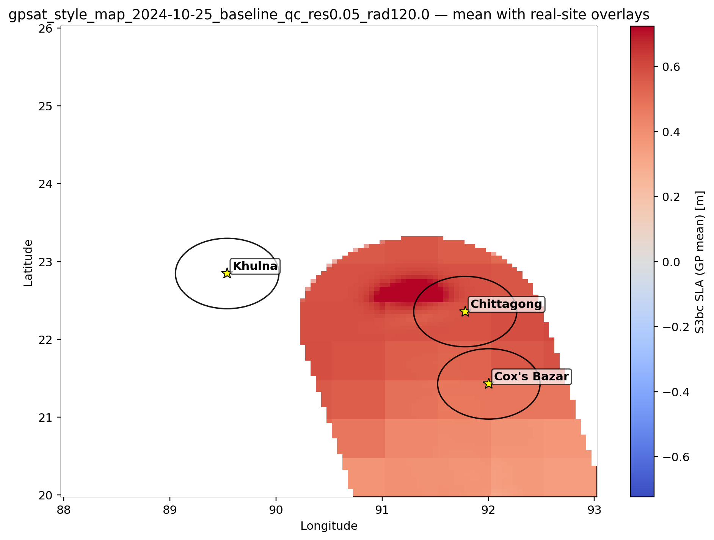  
Interpolated SLA fields with overlays marking observation points.  

---

### 10. Machine Learning Bias Prediction  
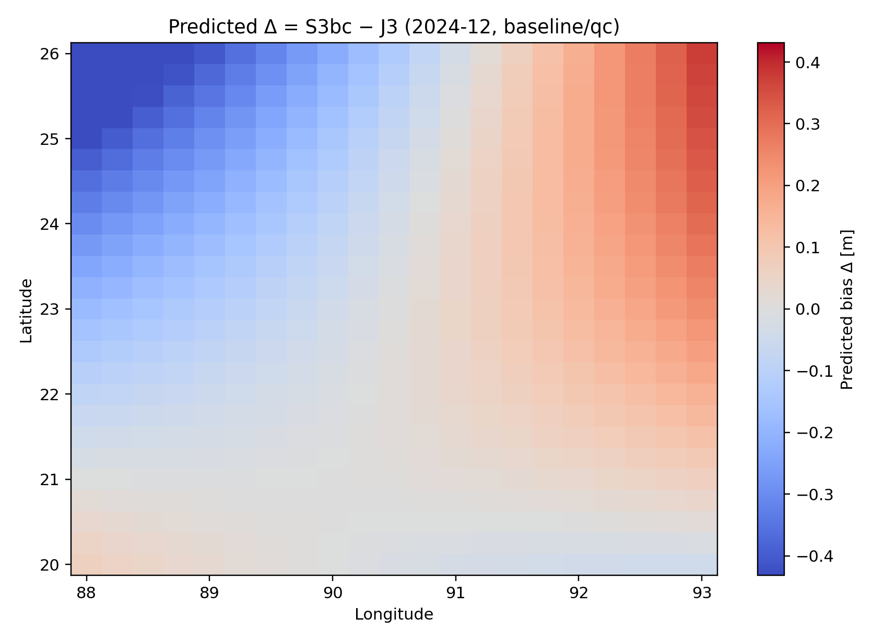  
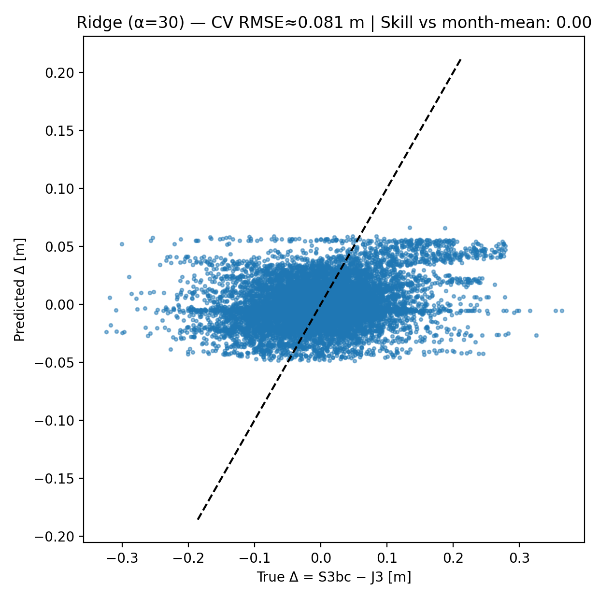  
Ridge regression was applied to predict systematic differences between Sentinel-3 and Jason-3 SLA.  

- **Left:** Spatial bias map from ridge regression.  
- **Right:** Scatter of predicted vs observed biases.  

---
