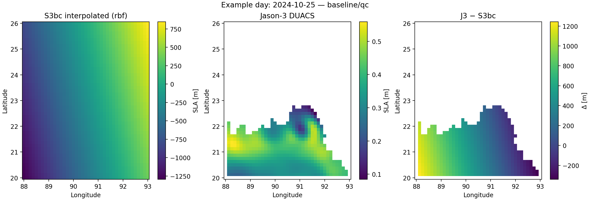

# Coastal Monitoring Using Satellite Altimetry  

This repository contains my workflow for analyzing coastal sea level variability along Bangladesh using multi-mission satellite altimetry (Jason-3 & Sentinel-3 SRAL).  

The main goals are to:  
- Subset and preprocess global SLA data for the Bangladesh coast.  
- Collocate Jason-3 and Sentinel-3 observations.  
- Interpolate SLA fields and validate cross-mission consistency.  
- Experiment with simple ML models and Gaussian Processes to map biases and coastal SLA structure.  

---

## 1. Preprocessing  

The starting point was the global CMEMS DUACS SLA dataset.  

- Subset to **88–93°E, 20–26°N** (coastal Bangladesh).  
- Saved as a smaller NetCDF for repeat use.  
- Quick mean-SLA plot to confirm data coverage.  

**Why:** keeps the workflow light and focused on the coast instead of the full global grid.  

**Output:**  
- `processed_sla_2024_bangladesh.nc`  

---

## 2. Sentinel-3 SRAL (20 Hz) Track Extraction  

Steps:  
- Subset raw SRAL data to the same region/time window.  
- Flattened into tidy table (`lon, lat, time, SLA`).  
- Saved per-track files for later use.  

**Why:** Jason-3 follows fixed ground tracks, so SRAL data needed to be reshaped to align for collocation.  

**Output:**  
- Flattened track files in `/Preprocessing`  

---

## 3. Collocation (CollocationV3)  

Matched Jason-3 and Sentinel-3 observations in space/time.  

- **Windows:** 10 km / 24 h.  
- **QC filters:** removed outliers and large |Δ| mismatches.  
- **Bias correction:** applied **daily-median correction** (S3 vs J3).  

**Outputs:**  
- `s3_j3_pairs_baseline_qc.parquet`  
- Daily/monthly bias CSVs  

---

## 4. Interpolation & Analysis (InterpolationV2)  

Interpolated Sentinel-3 (bias-corrected) SLA to a regular grid and validated against Jason-3.  

- **Interpolation:** radial basis function (thin-plate spline).  
- **Grid:** 0.125° (matches DUACS resolution).  
- **Validation:** scatter plots, RMSE vs gap, residual maps, seasonal cycles.  

**Figures produced:**  
1. Daily bias method comparison  
2. Scatter (S3bc vs J3)  
3. RMSE vs collocation gap  
4. Spatial residual map  
5. Daily interpolated maps  
6. Seasonal SLA cycle (monsoon vs rest)  
+ stricter QC scatter  

**Outputs:**  
- `s3bc_interpolated_daily_rbf_baseline_qc.nc`  
- `daily_pair_stats_baseline_qc.csv`  
- `monthly_interp_pair_stats_baseline_qc.csv`  
- Figures under `/InterpolationV2/Figures`  

---

## 5. Machine Learning Experiments (ML)  

Two experimental approaches to model SLA biases and coastal fields:  

### 5.1 Ridge Regression Bias Maps  
- Learned Δ = (S3bc − J3) using polynomial spatial terms + seasonal cycle.  
- GroupKFold CV by month (avoids leakage).  
- Produced bias map for a target month on 0.25° grid.  
- Compared against a monthly-mean baseline.  

**Outputs:**  
- Bias map parquet + scatter/map PNGs  
- Model JSON with coefficients/settings  
- Metrics CSV  

### 5.2 Gaussian Process “GPSat-style” Maps  
- Tiled GP regressions (1° tiles, 0.5° overlap).  
- Kernel: `Const × RBF([60 km, 60 km, 1.5 d]) + White noise`.  
- Inverse-variance blending to stitch tiles with uncertainty.  
- High-res 0.05° daily SLA maps.  
- Bangladesh basemap overlay with city markers.  

**Outputs:**  
- `gpsat_style_map_<date>.parquet` (mean/std/n_neighbors)  
- GP mean + uncertainty figures  
- Basemap overlay PNG  
- Run log JSON  

---

# Coastal Monitoring Using Satellite Altimetry  
Baseline Analysis Outputs (Bangladesh Coast, 2024)  

This repository contains figures and analysis outputs from the project **"Coastal Monitoring Using Satellite Altimetry"**, focusing on sea level variability and cross-mission consistency using Jason-3 and Sentinel-3 altimetry data.  

---

## Figures

### 1. Daily Bias Stability  
  
Daily median bias (Sentinel-3 minus Jason-3) compared with the global mean.  
This figure shows that local biases fluctuate day to day and differ from the global background signal, which makes applying daily bias correction important before combining datasets.  

---

### 2. Cross-Mission SLA Comparison  
  
  
Scatter plots comparing Sentinel-3 and Jason-3 SLA under strict QC.  

- **Left:** A heavy scatter including all pairs.  
- **Right:** A corrected view (S3 bias-corrected vs Jason-3).  

The bias correction clearly improves alignment between missions.  

---

### 3. Validation Trade-offs  
  
RMSE plotted as a function of spatial separation and temporal difference between collocated points.  
This shows how stricter thresholds (shorter distance / tighter time window) reduce error, while looser thresholds increase sample size but also noise.  

---

### 4. Residual Bias Map (0.25° grid)  
  
Spatial distribution of mean residuals (Jason-3 minus S3bc) averaged onto a 0.25° grid.  

- **Green areas:** close agreement (near zero).  
- **Blue patches:** Jason-3 lower than S3bc.  
- **Red patches:** Jason-3 higher than S3bc.  

Residuals are generally small (±0.1 m), showing collocation + bias correction substantially improves consistency.  

---

### 5. Example Day (2024-10-25)  
  
Three-panel view of a single day:  

- **Left:** Interpolated S3bc SLA (RBF method).  
- **Middle:** Jason-3 DUACS SLA (daily gridded).  
- **Right:** Difference (Jason-3 − S3bc).  

The Jason-3 grid captures sharper coastal features, while S3bc interpolation produces smoother fields. Differences highlight where the two missions diverge.  

---

### 6. Seasonal Cycle (Jul–Dec 2024)  
  
Monthly SLA means for Jason-3 and interpolated S3bc, with 95% confidence intervals.  

- Jason-3: stable monthly means with low uncertainty.  
- S3bc: noisier, particularly during monsoon months (July, October) when track coverage is sparse.  

Despite the noise, both missions track the seasonal cycle consistently, especially in the post-monsoon period.  

---

### 7. Gaussian Process Interpolation  
  
Interpolated SLA fields from Sentinel-3, showing both mean SLA and uncertainty.  
Uncertainty is higher where track density is low, especially near coastal gaps, but overall structure is captured.  

---

### 8. SLA Fields Over Bangladesh  
  
Interpolated SLA projected on a Bangladesh basemap.  
Key coastal cities (Khulna, Chittagong, Cox’s Bazar) are shown to provide local geographic reference for interpreting coastal sea-level impacts.  

---

### 9. SLA with Observation Overlays  
  
Interpolated SLA fields with overlays marking observation points.  
This helps assess whether the interpolation matches well at reference locations.  

---

### 10. Machine Learning Bias Prediction  
  
  
Ridge regression was applied to predict systematic differences between Sentinel-3 and Jason-3 SLA.  

- **Left:** Spatial bias map from ridge regression.  
- **Right:** Scatter of predicted vs observed biases.  

This shows that machine learning can capture broad bias structures, though fine-scale variability remains harder to resolve.  

---

## Notes
- **Region of Interest:** 88–93°E, 20–26°N (Bangladesh Coast)  
- **Missions:** Jason-3 & Sentinel-3 SRAL  
- **QC:** Baseline collocation window (10 km / 24 h), daily-median bias correction  
- **Focus:** Coastal SLA variability, monsoon seasonality, cross-mission consistency  

